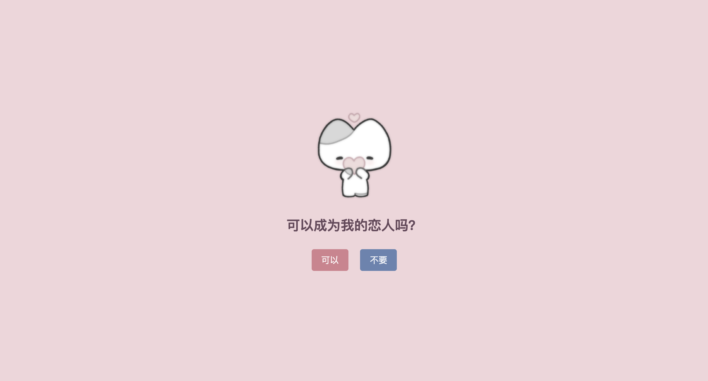
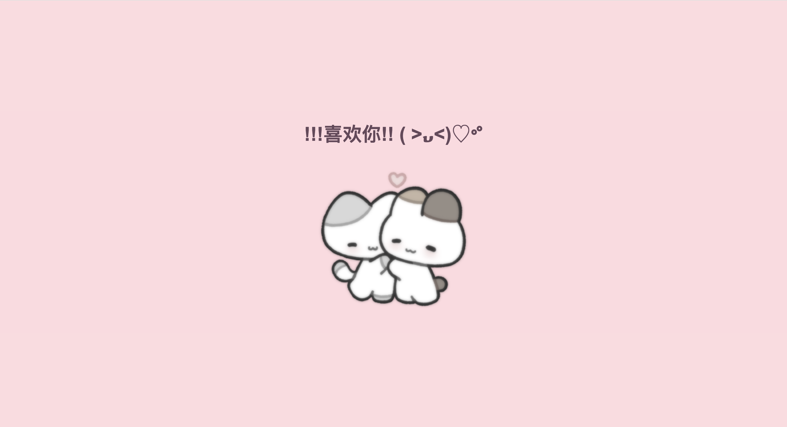
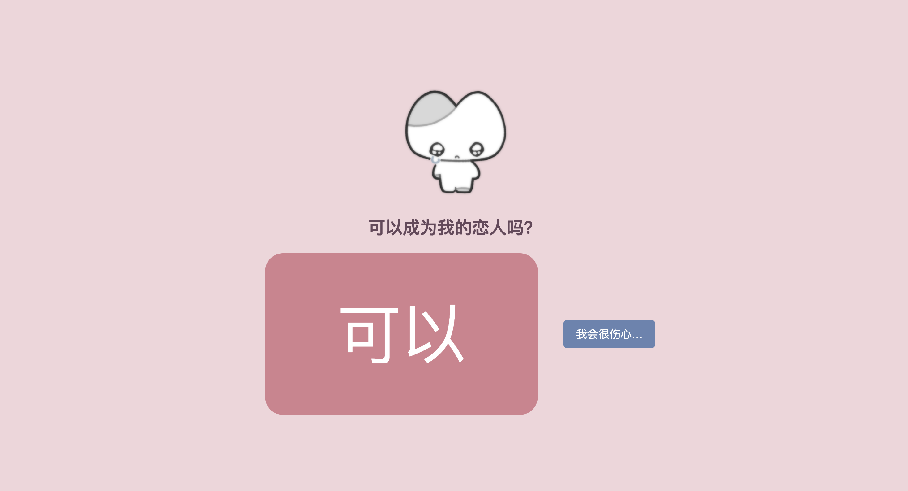

# ❤️ 浪漫表白网页

> 你能成为我的恋人吗？

一个充满趣味和动态效果的告白网页，点击“不要”按钮会触发各种互动效果，最终引导用户选择“可以”进入成功页面。







## ✨ 功能特性

- **动态交互**：多次点击“不要”按钮时触发：
  - 按钮移动、缩放，文字和图片上移
  - 5种不同的按钮文案变化
  - 图片根据点击次数切换表情（震惊 → 思考 → 生气 → 哭泣）
- **个性化显示**：通过URL参数 `?name=用户名` 显示指定名称
- **响应式设计**：适配手机和电脑屏幕
- **成功页面**：点击“可以”后跳转至甜蜜告白界面

## 🛠️ 使用说明
1. **准备图片**  
   在项目根目录创建 `images` 文件夹，放入以下图片：
   - `heart.png`（初始爱心）
   - `shocked.png`（震惊表情）
   - `think.png`（思考表情）
   - `angry.png`（生气表情）
   - `crying.png`（哭泣表情）
   - `hug.png`（拥抱图片）

2. **个性化访问**  
   在浏览器中打开时添加URL参数：index.html?name=对方昵称（昵称超过20字会自动截断）

3. **本地运行**  
   直接双击打开 `index.html` 或通过Web服务器部署

## 📁 文件结构

```bash
.
├── index.html          # 主页面结构
├── style.css           # 样式设计
├── script.js           # 交互逻辑
└── images/             # 表情图片资源
    ├── heart.png
    ├── shocked.png
    ├── think.png
    ├── angry.png
    ├── crying.png
    └── hug.png
```

## 💻 技术栈
- HTML5
- CSS3（Flex布局、媒体查询、过渡动画）
- JavaScript（DOM操作、URL参数解析）

## ⚙️ 自定义修改
- **修改样式**：在 `style.css` 中调整颜色、字体、尺寸
- **更换文案**：在 `script.js` 中修改 `noTexts` 数组和成功页文本
- **调整动画**：修改 `translateX/translateY` 参数或 `scale` 倍率

## 🌐 浏览器兼容
支持现代浏览器（Chrome/Firefox/Edge 最新版）

---

> 💡 提示：实际使用时建议搭配浪漫背景音乐效果更佳！
